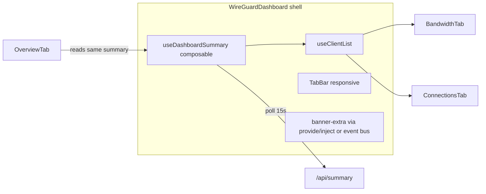

# NC WireGuard UI/UX Implementation Plan (v1.1.0)

**Repo:** [`/media/4TB/nc-wireguard`](/media/4TB/nc-wireguard) (primary)  
**Cross-repo:** [`apps/nc_gcs/src/components/common/NcGcsAppShell.vue`](/media/4TB/nc-gcs/apps/nc_gcs/src/components/common/NcGcsAppShell.vue) (banner icon only)  
**Operator choices:** mixed desktop+phone; **5 tabs on desktop**, **Overview + “More…” on mobile**; **full pass (Phases A + B + C)**

---

## Goals

| Goal | Success signal |
|------|----------------|
| Fix first-visit bug | Deep-link `#bandwidth` shows populated client dropdown |
| Reclaim vertical space | Overview table visible above fold on 1080p without scrolling past ~120px chrome |
| Responsive | 375px usable (card list); 1440px dense (table + side-by-side charts) |
| Parity + polish | Keep 5-tab mental model; add search/sort, row-click config, copy toast, peer state badges |
| NC integration | Shield icon in shell; light/dark via CSS variables |

---

## Architecture: shared shell state

Today [`WireGuardDashboard.vue`](/media/4TB/nc-wireguard/src/components/WireGuardDashboard.vue) only sets `clients` when [`OverviewTab`](/media/4TB/nc-wireguard/src/components/tabs/OverviewTab.vue) emits `clients-updated`. [`useClientList.js`](/media/4TB/nc-wireguard/src/composables/useClientList.js) exists but is unused.



**New composable:** `useDashboardSummary.js` — single fetch/poll for summary + health; exposes `clients`, `stats`, `health`, `lastUpdate`, `serverBootTime`, `connectedCount`, `loading`. OverviewTab consumes it instead of owning fetch logic (or wraps it and only renders table).

**Banner-extra:** Move status chips out of Overview into [`main.js`](/media/4TB/nc-wireguard/src/main.js) mount wrapper (same pattern as wg-easy link today): `3/5 online · Sidecar OK · Updated HH:MM:SS`. Health card row on Overview **removed**.

---

## Responsive breakpoints

| Breakpoint | Behavior |
|------------|----------|
| `<768px` | Tab bar: **Overview** button + **More ▾** menu (Bandwidth, Connections, Map, System). Overview: **peer cards** (no 10-col table). Charts stack. Map full-width; IP list collapsed by default. |
| `768–1023px` | All 5 tabs (scrollable tab row). Overview: **6-column table** (hide Endpoint, Expires, Enabled — expand row). Charts stack or 2-col if room. |
| `≥1024px` | Full tab row. Overview: compact table (8 cols max; Endpoint in expand). Bandwidth **2-col charts**. Map **60/40 split**. System: CPU+Mem combined. |

Hash routing unchanged (`#overview`, etc.); mobile More menu sets hash on pick.

---

## Phase A — Bug fix + quick wins (ship first)

### A1. Shell-level summary + client list
- Add `useDashboardSummary.js`; call from `WireGuardDashboard` on mount + 15s interval (respect visibility pause in Phase C, but wire hook now).
- Wire `useClientList.setClients` from summary response.
- Refactor `OverviewTab` to use shared summary (avoid duplicate polls when Overview active).

**Acceptance:** Open app directly at `#connections` — client `<select>` lists all peers.

### A2. Compact header
- Remove standalone health card on Overview.
- `banner-extra`: online fraction, sidecar/wg-easy chips, `lastUpdate`.
- Stat grid: row 1 = Connected, Total, Total Rx, Total Tx; row 2 = single **HostMetricsStrip** (CPU / Mem / Disk inline bars, not 3 giant cards).
- Trim `.nc-wg-dashboard` padding; drop inner `max-width: 72rem` constraint.

### A3. Overview table density
- Desktop: columns = Name, Status, IP, Last seen, Rx, Tx, actions (chevron expand).
- Expand row or slide-down: Endpoint, Enabled, Expires, Config button.
- Mobile (`<768px`): `PeerCardList.vue` — card per client with same expand.

### A4. Bandwidth layout
- `@media (min-width: 1024px)`: `grid-template-columns: 1fr 1fr`.
- Remove duplicate Chart.js title when section header present.
- Chart height: `clamp(160px, 25vh, 320px)`.

### A5. Interaction quick wins
- Row click (table + card) → `PeerConfigModal`.
- Copy button → `@nextcloud/vue` toast or lightweight `.nc-wg-toast` (“Copied!”).
- **403 / disabled:** early gate in dashboard — friendly full-page copy + link to NC admin settings (reduce ErrorBanner spam).

**Version after A alone:** could ship as **1.0.1** hotfix; user asked for full pass → bundle into **1.1.0**.

---

## Phase B — Layout density + shared components

### B1. `HistoryToolbar.vue`
Shared bar for Bandwidth, Connections, System:

```
[ Time range ▼ ]  [ Client ▼ ]  [ Refresh ]     (optional: export — out of scope)
```

Extract duplicated markup from tab SFCs; emit `refresh`, `range-change`, `client-change`.

### B2. Map split + collapsible list
- Desktop: CSS grid `1.2fr 0.8fr`; map `height: min(50vh, 520px)`.
- Right panel: collapsible “IP list” (default **collapsed** when markers exist).
- Mobile: map full width; list below accordion.

### B3. System charts
- Merge CPU + Memory into one dual-series chart (0–100% Y).
- Network chart stays separate (different units).

### B4. Overview search + sort
- Filter input above table/cards (name + IP substring).
- Sortable headers: Name, Status, Last seen, Rx (toggle asc/desc).
- Persist sort in sessionStorage optional (nice-to-have, low cost).

### B5. Banner icon (nc_gcs)
Add `nc_wireguard` entry to `BANNER_ICONS` in [`NcGcsAppShell.vue`](/media/4TB/nc-gcs/apps/nc_gcs/src/components/common/NcGcsAppShell.vue) — shield/lock path derived from [`nc-wireguard/img/app.svg`](/media/4TB/nc-wireguard/img/app.svg).

**Note:** nc-wireguard bundles its own shell copy in `vendor/nc-gcs-shell/` — update **both** if vendored mirror exists, or document that production uses nc_gcs from cloud app dependency.

---

## Phase C — Operator delight + mobile nav

### C1. Responsive tab bar (`TabBar.vue`)
- `≥768px`: existing 5-button row (optional badges).
- `<768px`: Overview tab + **NcActionsMenu** / native `<select>` styled as “More…” listing other tabs; active state reflects hash.

### C2. Tab badges + dynamic subtitle
- Overview `(connectedCount)`; Map `(geoCount)` after geo load.
- Subtitle: `vpn-vdroners.ddns.net · N peers` from summary (via `main.js` props or inject).

### C3. Peer state styling
- `enabled: false` → muted row/card + “Disabled” badge.
- `expiresAt` within 7 days → amber “Expiring” chip.

### C4. Footer metadata
- Show `serverBootTime` as “Host uptime since …” under stats or page footer.

### C5. Polling UX
- Subtle loading pulse on stat strip during refresh (not only initial load).
- Pause 15s poll when `document.hidden`; resume + immediate fetch on visible.

### C6. Peer config modal layout
- Wide screens: QR left, config textarea right.
- “Edit in wg-easy →” link to `https://vpn-vdroners.ddns.net/` (existing admin URL from settings).

### C7. Theme token audit
Replace hard-coded `#262626`, `#404040` in SCSS with `var(--color-main-background)`, `var(--color-border)`, `var(--color-text-maxcontrast)` — spot-check light theme in browser.

---

## New / touched files (expected)

| File | Change |
|------|--------|
| `src/composables/useDashboardSummary.js` | **New** — poll + parse summary |
| `src/composables/useClientList.js` | Extend or fold into summary composable |
| `src/components/WireGuardDashboard.vue` | Summary mount, TabBar, provide context |
| `src/components/TabBar.vue` | **New** — responsive tabs + More menu |
| `src/components/HistoryToolbar.vue` | **New** — shared filters |
| `src/components/HostMetricsStrip.vue` | **New** — CPU/Mem/Disk bars |
| `src/components/PeerCardList.vue` | **New** — mobile overview |
| `src/components/tabs/OverviewTab.vue` | Table density, search/sort, use summary |
| `src/components/tabs/BandwidthTab.vue` | Toolbar + grid layout |
| `src/components/tabs/ConnectionsTab.vue` | Toolbar + flag chips + truncate |
| `src/components/tabs/MapTab.vue` | Split layout + collapse |
| `src/components/tabs/SystemTab.vue` | Combined chart + toolbar |
| `src/components/common/PeerConfigModal.vue` | Toast, wide layout, wg-easy link |
| `src/main.js` | banner-extra status chips, dynamic subtitle |
| `src/assets/*.scss` | Breakpoints, tokens, tab/menu styles |
| `nc_gcs/.../NcGcsAppShell.vue` | `nc_wireguard` icon |
| `appinfo/info.xml`, `package.json`, `CHANGELOG.md` | **1.1.0** |

---

## Out of scope (unchanged)

- wg-easy write CRUD inside NC app
- Replacing Chart.js
- Merging 5 tabs into one scroll page on desktop
- Public `/dashboard` revival on Caddy

---

## Verification matrix

| Check | Method |
|-------|--------|
| Client filter on deep-link | Browser `#bandwidth` cold load |
| Viewports 375 / 768 / 1440 | Manual or cursor-ide-browser snapshots |
| Light + dark theme | NC admin theme toggle |
| All 5 tabs + More menu on mobile | Click-through |
| Copy toast | Peer config modal |
| Row click → modal | Overview table + card |
| Disabled/expiring styling | Test peer in wg-easy or mock summary |
| PHPUnit | `make gate-local` in nc-wireguard |
| Deploy | `scripts/deploy-nc-wireguard.sh` → version grep in container |

---

## Release workflow (nc-wireguard)

1. Check in plan: [`.cursor/plans/nc_wireguard_ui_ux.md`](/media/4TB/nc-wireguard/.cursor/plans/nc_wireguard_ui_ux.md) (copy of this plan)
2. Bump **1.0.0 → 1.1.0** (`info.xml`, `package.json`, lockfile, CHANGELOG)
3. `npm run build` → deploy script → browser verify
4. Commit nc-wireguard; commit scoped nc_gcs icon change; **ask before push** (triage-style for wireguard repo)

---

## Implementation order (single PR preferred)

Execute A1→A5, then B1→B5, then C1→C7. Run build + gate-local after Phase A (catch regressions early). Mobile TabBar (C1) can land with A if it unblocks testing, but badges (C2) depend on summary composable from A1.

```mermaid
gantt
  title NC WireGuard UI pass
  dateFormat X
  axisFormat %s
  section PhaseA
  Summary composable     :a1, 0, 1
  Compact header         :a2, 1, 2
  Table and cards        :a3, 2, 3
  Bandwidth grid         :a4, 3, 4
  Interactions           :a5, 4, 5
  section PhaseB
  HistoryToolbar         :b1, 5, 6
  Map split              :b2, 6, 7
  System charts          :b3, 7, 8
  Search sort            :b4, 8, 9
  Banner icon            :b5, 9, 10
  section PhaseC
  Mobile TabBar          :c1, 10, 11
  Badges subtitle        :c2, 11, 12
  Peer styling           :c3, 12, 13
  Polling UX             :c5, 13, 14
  Theme audit            :c7, 14, 15
```


