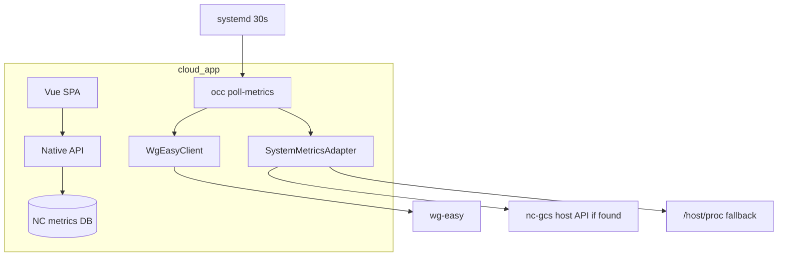

# Sidecar → NC WireGuard v2.0 — final plan (reviewed)

**Goal:** Remove `wg-dashboard` container. Backend moves into [`/media/4TB/nc-wireguard`](/media/4TB/nc-wireguard). Dashboard **must work** after cutover and at every milestone until P5.

**Your choices:**
- **Cutover:** ~15 min maintenance window (not long dual-run)
- **Host metrics:** Reuse existing NC-GCS service/route if audit finds one; else read-only `/host/proc` bind-mount in `cloud_app`

---

## Working-app guarantee

| Phase | Admin experience |
|-------|------------------|
| P0–P1 | v1.1.0 unchanged (proxy → sidecar) |
| P2 | Poller fills NC DB silently; UI still uses sidecar |
| P3 | Staging: native flag ON; production still proxy until P5 |
| P5 | Maintenance flip → stop sidecar → smoke (≤20 min) |
| P6 | Native only |

**Rollback (until P6):** `use_native_backend=0` + restart `wg-dashboard`.

---

## Feature gaps to port (complete list)

**Core (from sidecar `app.py`):** wg-easy session, 30s poll, bandwidth_log, connection_log + 180s FSM, GeoIP (7-day cache), system_metrics, 30-day prune, 6 read APIs, peer config.

**Easy to miss:** `serverBootTime`, IPv6 `endpoint_ip`, poll flock, heartbeat table, import `poll_state`, query param limits (hours 1–720, days 1–365), cold-start chart hints, encrypted creds, watchdog interval UI, non-admin 403, `dashboard_enabled` gate.

**New (in scope):** `schema-check`, `verify-import`, systemd unit templates, mock wg-easy CI tests, `cutover-native.sh`, NC DB backup script, 24h post-cutover poll monitor, native-backend admin/banner chip.

**Out of scope:** wg-easy write CRUD, Chart.js/Leaflet replacement, merging wg-easy container.

---

## P0 — Baseline + audit + fixtures

- Check in plan to `nc-wireguard/.cursor/plans/sidecar_to_nc_migration.md`
- Capture JSON fixtures → `tests/fixtures/sidecar/` (summary, bandwidth, connections, geoip, system, status, config)
- Expand [`docs/API_PARITY.md`](/media/4TB/nc-wireguard/docs/API_PARITY.md) (fields, params, errors)
- **Host metrics audit:** search [`/media/4TB/nc-gcs/services/`](/media/4TB/nc-gcs/services/), gcs-services compose, base-station telemetry — document reuse vs `/proc` fallback

**Gate P0:** `make gate-local` PASS on v1.1.0; ≥7 fixture files; API_PARITY cross-checked with Vue; host-metrics decision written.

---

## P1 — NC DB + admin (v1.2.0-alpha)

**Tables:** `nc_wg_bandwidth_log`, `nc_wg_connection_log`, `nc_wg_geoip_cache`, `nc_wg_system_metrics`, `nc_wg_poll_state`, `nc_wg_metrics_heartbeat`

**Settings:** wg-easy URL/creds (encrypted), poll interval, retention, geoip toggle, `use_native_backend`, watchdog interval UI

**Gate P1:** `occ nc_wireguard:schema-check` 0; PHPUnit mappers; admin wg-easy test OK; **proxy mode still works** (`gate-local` PASS).

---

## P2 — Poller + PHP services (v1.2.0-beta)

**Services:** `WgEasyClient`, `ConnectionStateMachine`, `GeoIpService`, `SystemMetricsCollector` (adapter), `MetricsPollService`, `MetricsPruneService`

**Commands:** `poll-metrics` (flock), `prune-metrics`; systemd timer in `docs/ops/`; `MetricsHealthJob` replaces `SidecarWatchdogJob`

**Gate P2:** 3 polls populate all tables; connect/disconnect event; geo on connect; flock works; heartbeat fresh; **UI still on sidecar** (`gate-local` PASS).

---

## P3 — Native API + staging (v1.3.0-rc)

Same NC URLs; flag `use_native_backend=1`. Minimal Vue: backend chip, system-unavailable warning, admin label updates.

**Gate P3:** PHPUnit parity vs fixtures; mock wg-easy CI; all 5 tabs + modal on **staging native ON**; `gate-local` PASS; sidecar still available as fallback on staging.

---

## P4 — Import historical SQLite

`import-sidecar-db` + `verify-import` (row counts, poll_state)

**Gate P4:** Counts match; charts show pre-migration data; idempotent; staging native works with imported data.

---

## P5 — Maintenance cutover (v2.0.0)

`scripts/cutover-native.sh` — backup → import → native ON → smoke → stop sidecar → VPN test

Optional: `/proc` mount in cloud compose if audit chose HostProcCollector

**Gate P5 (all required before done):**

| ID | Check |
|----|-------|
| G1 | No `wg-dashboard` container |
| G2 | Last poll < 60s (`/api/status`) |
| G3 | wg-easy OK |
| G4–G8 | All 5 tabs HTTP 200 / browser |
| G9 | `#bandwidth` client filter |
| G10 | Config modal + copy |
| G11 | `make gate-local` |
| G12 | VPN peer handshake |
| G13 | Maintenance ≤ 20 min |
| G14 | Rollback rehearsed on staging |

---

## P6 — Cleanup

Remove proxy code, sidecar settings, update docs, archive `wireguard/dashboard/`, tag v2.0.0

**Gate P6:** No `wg-dashboard:8185` in code; gate-local without sidecar; browser 375/768/1440; 24h poll health; backup script updated.

---

## Architecture (final)

**Effort:** ~13–17 dev days across P0–P6.
